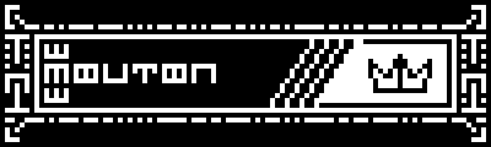

## Welcome on my Github profile !

### The name's Mouton, studying ingeneering at Annecy, France. I'm not a pro at all but I make some experiments with Python

Here are some some cool infos !
- Currently working on a SAR calculator for events
- Trying to learn graphical interface in python
- Don't know how to install linux properly

<!--
**MoutonBinoclard/MoutonBinoclard** is a ✨ _special_ ✨ repository because its `README.md` (this file) appears on your GitHub profile.

Here are some ideas to get you started:

- 🔭 I’m currently working on ...
- 🌱 I’m currently learning ...
- 👯 I’m looking to collaborate on ...
- 🤔 I’m looking for help with ...
- 💬 Ask me about ...
- 📫 How to reach me: ...
- 😄 Pronouns: ...
- ⚡ Fun fact: ...
-->
